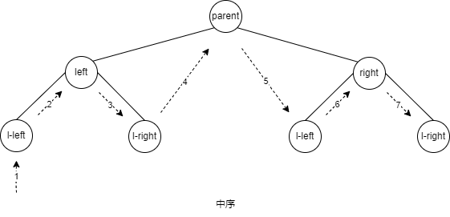
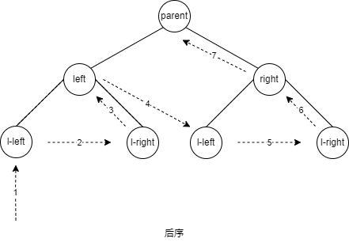

# traverseTree
## 树的遍历
1. 遍历顺序是根据访问父结点的时序确定的
### 先序遍历
1. 优先访问父结点，然后依次访问左子结点，右子结点
```javascript
  const traverse = (parentNode, callback)=>{
    if(parentNode !== null){
      // parent node
      callback(parentNode)
      // left node
      traverse(parentNode.left, callback)
      // right node
      traverse(parentNode.right, callback)
    }
  }
```

### 中序遍历
1. 优先访问左子结点， 然后访问父结点，最后访问右子结点
```javascript
  const traverse = (parentNode, callback)=>{
    if(parentNode !== null){
      // left node
      traverse(parentNode.left, callback)
      // parent node
      callback(parentNode)
      // right node
      traverse(parentNode.right, callback)
    }
  }
```



### 后序遍历
1. 优先访问左右子结点，最后访问父结点

```javascript
  const traverse = (parentNode, callback)=>{
    if(parentNode !== null){
      // left node
      traverse(parentNode.left, callback)
      // right node
      traverse(parentNode.right, callback)
      // parent node
      callback(parentNode)
    }
  }
```

